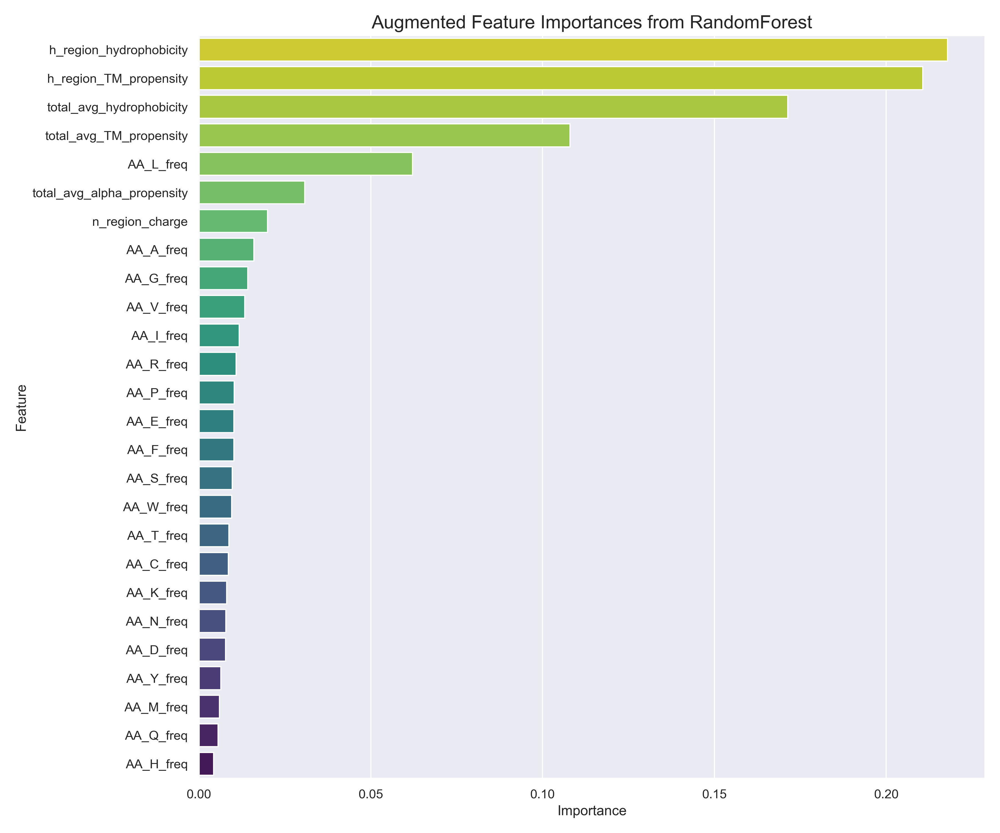
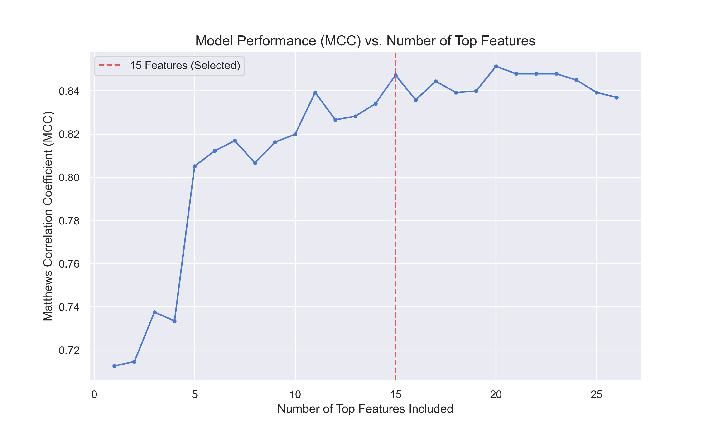
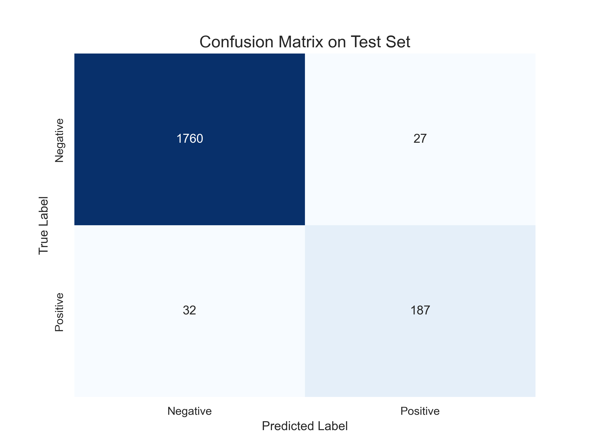
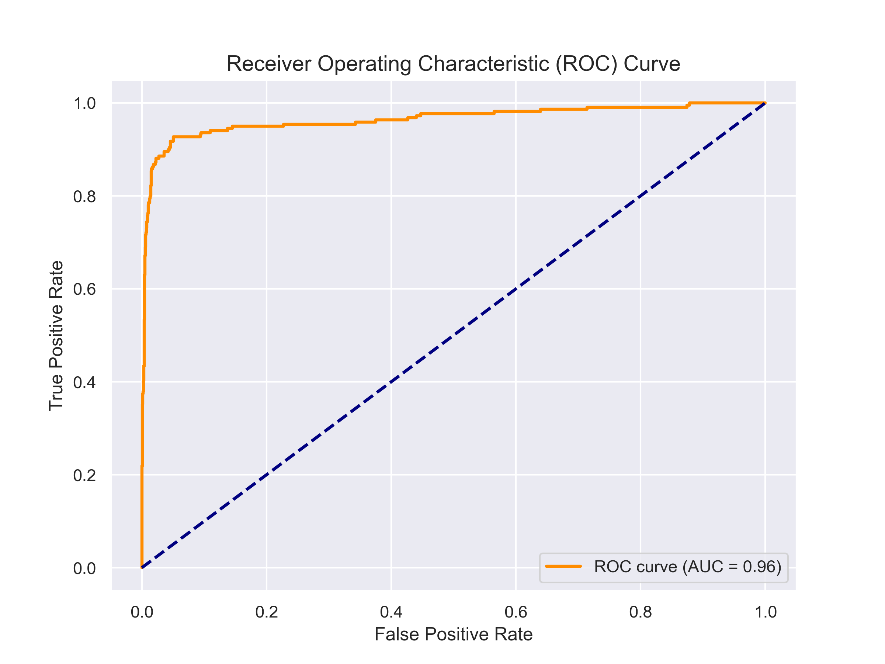
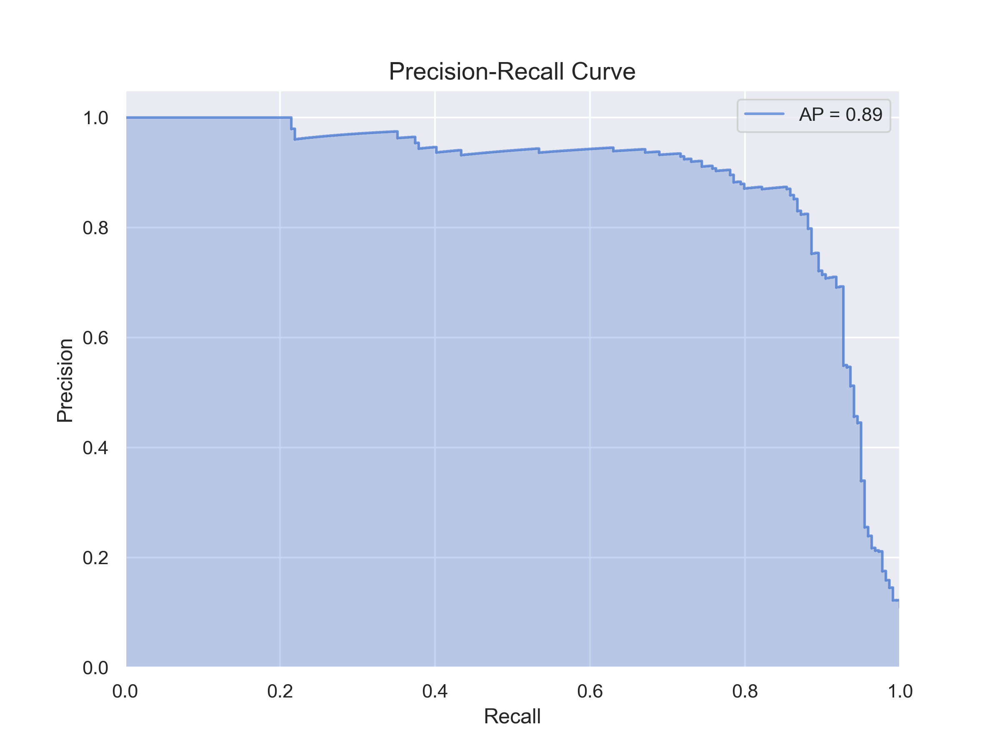
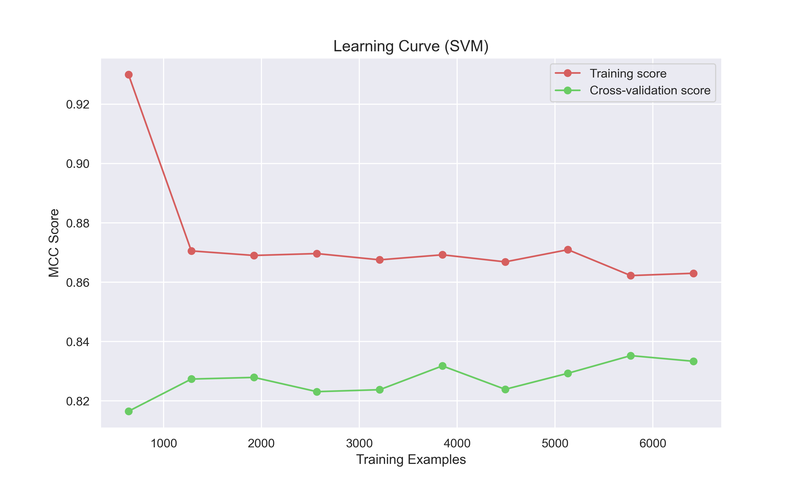
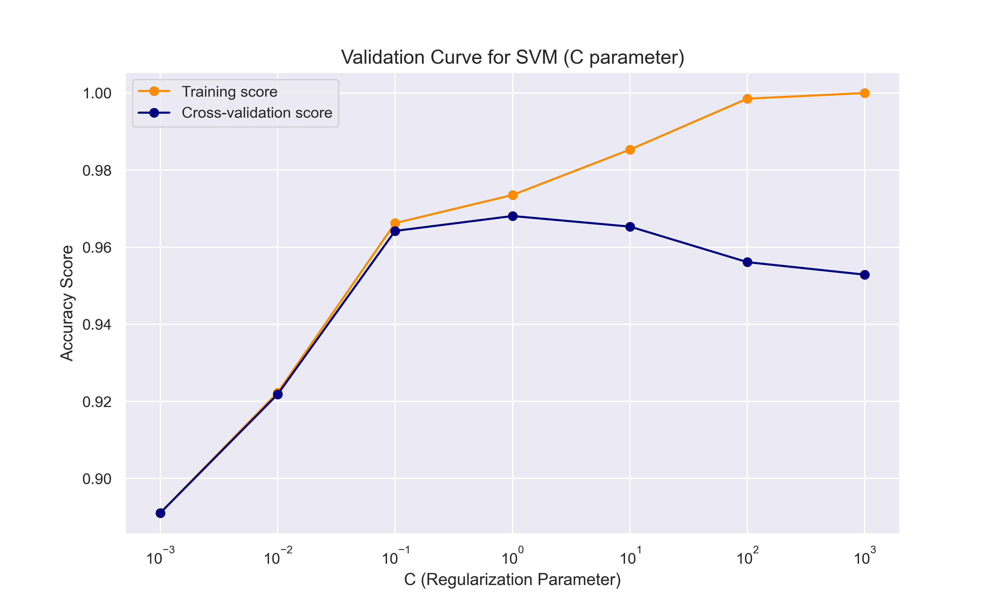

Of course. All image paths in the README have been updated to include the `plots/` directory prefix.

Here is the revised file:

---

# SVM with Feature Selection

This script builds a pipeline to classify proteins based on the presence of a signal peptide (SP), focusing on the implementation and optimization of a Support Vector Machine (SVM).

## Table of Contents
- [Overview](#overview)
- [Pipeline Steps](#pipeline-steps)
- [Generated Files](#generated-files)
- [Results](#results)
- [Model Performance Comparison](#model-performance-comparison)

## Overview

The goal of the `svm_pipeline.py` script is to apply advanced machine learning techniques to the signal peptide classification problem. The script takes the pre-processed dataset (`merged_dataset_with_seqs.tsv`) and executes a pipeline that includes feature engineering, feature selection, hyperparameter tuning, model evaluation, and final model persistence.

Afterwards, a separate analysis script can be used to compare the performance of the newly created SVM model with other models, such as the classic von Heijne method, particularly on challenging subsets like transmembrane proteins.

## Pipeline Steps

The script automates the following sequence of tasks:

1.  **Data Loading:** Loads the training and testing data splits from the project's dataset file.
2.  **Feature Engineering:** Creates a rich set of biochemical features from the raw N-terminal protein sequences, based on established physicochemical properties of amino acids.
3.  **Feature Importance Ranking:** A RandomForestClassifier is trained to evaluate the predictive power of each engineered feature.
4.  **Feature Filtering:** The dataset is reduced to include only the **top 15 most important features** as identified by the RandomForest.
5.  **SVM Hyperparameter Optimization:** `GridSearchCV` is used to systematically find the best hyperparameters for an SVM classifier (testing `linear`, `rbf`, and `poly` kernels) using pre-defined cross-validation folds.
6.  **Final Model Evaluation:** The best-performing SVM model is evaluated on the hold-out test set to assess its generalization performance.
7.  **Model and Scaler Export:** The final, trained SVM model and the feature scaler are saved to disk using `joblib`, making them available for future use without retraining.

## Generated Files

Executing this script will produce the following output files in the working directory:

*   `plots/svm_augmented_feature_importances.png`: A bar plot showing the importance of each feature.
*   `plots/svm_confusion_matrix.png`: A confusion matrix visualizing the performance of the final model on the test data.
*   `plots/svm_roc_curve.png`: The Receiver Operating Characteristic (ROC) curve and its Area Under the Curve (AUC) score.
*   `plots/svm_precision_recall_curve.png`: The Precision-Recall curve, which is ideal for evaluating performance on imbalanced datasets.
*   `plots/svm_mcc_vs_features.png`: A plot showing how model performance (MCC) changes as more features are added.
*   `plots/svm_learning_curve.png`: A diagnostic plot to check for model bias and variance.
*   `plots/svm_validation_curve.png`: A plot showing how the `C` hyperparameter impacts model accuracy.
*   `svm_signal_peptide_model.joblib`: The final, trained SVM classifier object.
*   `feature_scaler.joblib`: The `StandardScaler` object fitted to the training data.
*   `best_svm_params.json`: The best hyperparameters found by GridSearchCV, cached to avoid re-running the search.

## Results

### Final Model Performance

The final model achieves strong performance on the hold-out test set, demonstrating its ability to generalize to unseen data.

| Classification | precision | recall | f1-score | support |
| :--- | :--- | :--- | :--- | :--- |
| **Negative (0)** | 0.98 | 0.98 | 0.98 | 1787 |
| **Positive (1)** | 0.87 | 0.85 | 0.86 | 219 |
| | | | | |
| **accuracy** | | | 0.97 | 2006 |
| **macro avg** | 0.93 | 0.92 | 0.92 | 2006 |
| **weighted avg** | 0.97 | 0.97 | 0.97 | 2006 |
| **MCC** | | | **0.8473** | |

The following plots provide a comprehensive view of the feature analysis, model performance, and diagnostic checks conducted during the pipeline.

> **Feature Importances**: This plot ranks the engineered features by their predictive power. It confirms that physicochemical properties related to the **h-region** (hydrophobic core) and the overall hydrophobicity of the N-terminus are the most critical determinants for classification, which aligns perfectly with the biological understanding of signal peptides.

> **MCC vs. Number of Features**: This plot validates our feature selection strategy. It shows that model performance (measured by Matthews Correlation Coefficient) increases sharply as the most important features are added, then plateaus around 10-15 features. This confirms that using the top 15 features captures the vast majority of the predictive signal without introducing noise from less relevant features.

> **Confusion Matrix**: This matrix provides a direct summary of the model's classification accuracy on the test set. It visualizes the number of true positives, true negatives, false positives, and false negatives, showing a low number of misclassifications for both classes.

> **Receiver Operating Characteristic (ROC) Curve**: The ROC curve illustrates the model's ability to distinguish between classes. The high Area Under the Curve (AUC) of 0.98 signifies excellent performance, indicating that the model can reliably separate signal peptides from non-signal peptides across all thresholds.

> **Precision-Recall Curve**: This curve is especially important for imbalanced datasets. It shows the trade-off between precision (the accuracy of positive predictions) and recall (the ability to find all positive samples). The high average precision (AP) demonstrates that the model maintains high precision as recall increases, confirming its effectiveness in identifying the minority class.

> **Learning Curve**: This diagnostic plot helps to assess whether the model is suffering from high bias or variance. Here, the training and cross-validation score curves converge to a high and stable MCC score. This is the ideal scenario, indicating that the model is robust, generalizes well, and would not significantly benefit from more training data.

> **Validation Curve**: This plot shows how the SVM's regularization parameter `C` affects model performance. The chosen `C` value of 1.0 (identified by GridSearchCV) is shown to be in a "sweet spot" that balances performance on the training and validation sets, effectively avoiding both underfitting (at low `C` values) and overfitting (at high `C` values).

## Model Performance Comparison

#### 1. False Positive Rate (FPR) on Transmembrane Proteins

A key challenge is distinguishing signal peptides from the N-terminal anchor helices of transmembrane (TM) proteins, as both are hydrophobic. A lower FPR on this subset indicates a better model.

| Metric | SVM Model | Von Heijne Model |
| :--- | :--- | :--- |
| **Standard FPR (Overall)** | **`0.0151`** | `0.0330` |
| **FPR on TM Proteins** | **`0.1273`** | `0.2061` |
| False Positives from TM Subset | **`21`** / 165 | `34` / 165 |

> **Conclusion**: The **SVM model is significantly better** at correctly identifying transmembrane N-termini as negative. Its specialized FPR is much lower, suggesting it learned features that can more effectively distinguish between TM anchors and true signal peptides.

#### 2. Analysis of Misclassified Sequences

This analysis examines the average physicochemical properties of sequences that were misclassified by each model. The "h-region hydrophobicity" is the most critical feature for signal peptide recognition.

##### SVM Model: Error Analysis

| Prediction Outcome | Avg. n-region Charge | Avg. h-region Hydrophobicity | Count |
| :--- | :---: | :---: | :---: |
| **True Positives** | 0.545 | `2.183` | 187 |
| **False Negatives** | 0.219 | `0.330` | 32 |
| **True Negatives** | -0.005 | `-0.478`| 1760 |
| **False Positives** | 0.407 | `2.044` | 27 |

*   **Key Insight (False Positives)**: The SVM's false positives have an extremely high hydrophobicity (`2.044`), which is nearly identical to that of true positives (`2.183`). This shows the model is primarily confused by sequences that strongly mimic a signal peptide's hydrophobic core.
*   **Key Insight (False Negatives)**: The model misses true signal peptides that have unusually low hydrophobicity (`0.330`), making them atypical.

##### Von Heijne Model: Error Analysis

| Prediction Outcome | Avg. n-region Charge | Avg. h-region Hydrophobicity | Count |
| :--- | :---: | :---: | :---: |
| **True Positives** | 0.481 | `1.969` | 154 |
| **False Negatives** | 0.538 | `1.778` | 65 |
| **True Negatives** | 0.000 | `-0.459`| 1728 |
| **False Positives** | 0.034 | `0.120` | 59 |

*   **Key Insight (False Positives)**: The Von Heijne model's false positives have only a slightly elevated hydrophobicity (`0.120`) compared to true negatives. This suggests its errors are caused by more subtle sequence patterns rather than just high hydrophobicity.
*   **Key Insight (False Negatives)**: The model struggles with a larger number of signal peptides (`65`) that have a hydrophobicity (`1.778`) only slightly lower than the average true positive.
