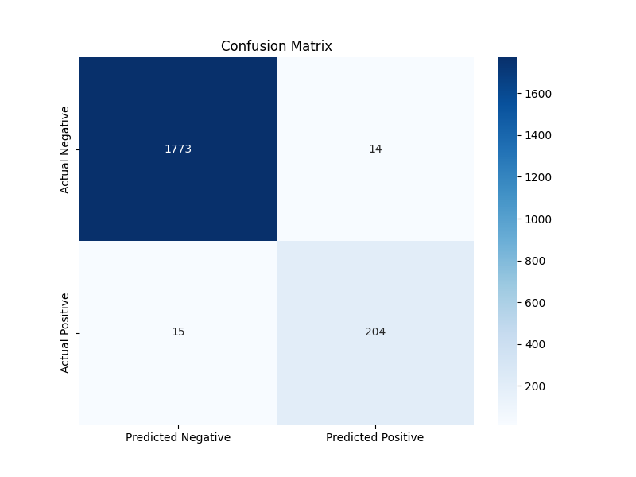
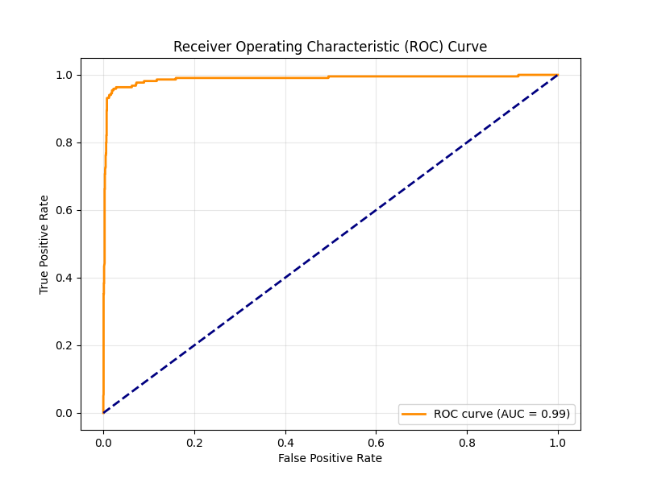
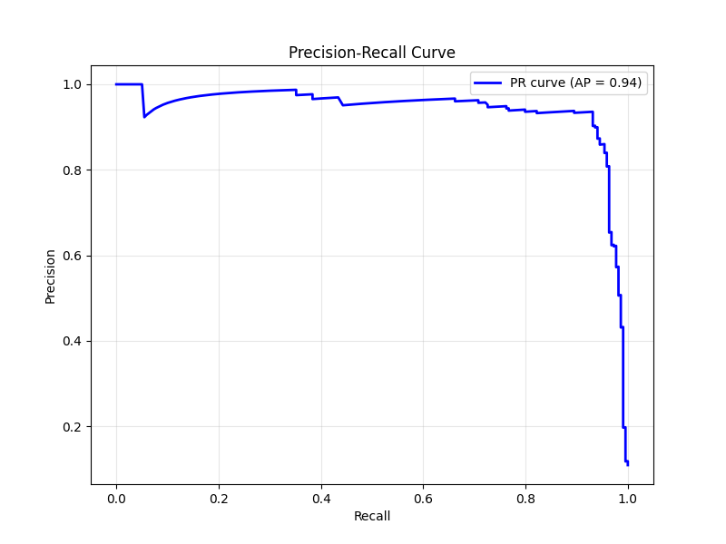

# Deep Learning for Signal Peptide Prediction

This directory contains the code for building, training, and evaluating a deep learning model to predict the presence of signal peptides in protein sequences.

## Table of Contents
- [Overview](#overview)
- [Pipeline Steps](#pipeline-steps)
- [Model Architecture](#model-architecture)
- [How to Run](#how-to-run)
- [Generated Files](#generated-files)
- [Results](#results)

## Overview

The primary script, `deep_learning.py`, implements a complete pipeline for this task. It handles data loading, preprocessing, model training with early stopping, and final evaluation on a held-out test set. The model architecture is a combination of a Convolutional Neural Network (CNN) and a bidirectional Long Short-Term Memory (LSTM) network.

The other scripts in this directory are used for comparing the performance of this deep learning model against other methods like Support Vector Machines (SVM) and the Von Heijne algorithm.

## Pipeline Steps

The script automates the following sequence of tasks:

1.  **Data Loading and Preparation**: Loads the dataset from `merged_dataset_with_seqs.tsv`, splits it into training, validation, and test sets, and calculates a class weight to handle imbalance.
2.  **One-Hot Encoding**: Converts amino acid sequences into numerical tensors using one-hot encoding, padded or truncated to a fixed length (70).
3.  **Model Training**: Trains the `SignalPeptideClassifier` model on the training data.
4.  **Validation and Early Stopping**: Evaluates the model on a validation set after each epoch and uses the Matthews Correlation Coefficient (MCC) to track performance. Training stops early if the validation MCC does not improve for a set number of epochs (`patience=15`).
5.  **Model Checkpointing**: The best-performing model based on validation MCC is saved to `best_signal_peptide_model.pth`.
6.  **Final Evaluation**: The best model is loaded and evaluated on the held-out test set to provide a final, unbiased assessment of its performance.
7.  **Reporting and Visualization**: Generates a classification report, confusion matrix, ROC curve, and Precision-Recall curve to visualize the model's performance.

## Model Architecture

The model (`SignalPeptideClassifier`) is designed to capture local patterns and long-range dependencies within the amino acid sequences.

1.  **Input Layer**: Protein sequences are one-hot encoded into a 2D tensor.
2.  **Convolutional Layer**: A 1D CNN with a kernel size of 17 is applied to the sequence to extract local motifs and features from the amino acid patterns. This is followed by Batch Normalization and a ReLU activation function.
3.  **Bi-LSTM Layer**: The output from the CNN is passed to a 2-layer bidirectional LSTM. This allows the model to learn long-range dependencies in the sequence from both forward and backward directions.
4.  **Fully Connected Block**: The output from the last time step of the LSTM is fed into a series of fully connected layers with Dropout for regularization, ultimately producing a single logit for binary classification.

## How to Run

### Prerequisites

Ensure you have Python installed with the following libraries:
- PyTorch
- Pandas
- NumPy
- Scikit-learn
- Matplotlib
- Seaborn

You can install them using pip:
```bash
pip install torch pandas numpy scikit-learn matplotlib seaborn
```

### Running the Training Script

To train and evaluate the model, simply run the `deep_learning.py` script from within this directory:
```bash
python deep_learning.py
```
The script expects the dataset file (`merged_dataset_with_seqs.tsv`) to be in a specific path. You may need to adjust the `FILE_PATH` variable in the `Config` class within the script to point to the correct location.

## Generated Files

Executing this script will produce the following output files:

*   `best_signal_peptide_model.pth`: The saved weights of the best performing model.
*   **Console Output**: A detailed classification report including precision, recall, F1-score, and MCC for the test set.
*   **Plots**: The script will display plots for the Confusion Matrix, ROC Curve, and Precision-Recall Curve during execution.

This directory also contains scripts for comparing the deep learning model with other approaches:
- `SVM.py`: Implementation of an SVM classifier.
- `vonHeijne.py`: Implementation of the Von Heijne algorithm.
- `SVM_DL_comparison.py`, `SVM_vonHeijne_comparison.py`, `complete_comparison.py`: Scripts to run comparisons and generate reports.
- `final_model_comparison_report.md`: A markdown file summarizing the final comparison results.

## Results

The final model performance is evaluated on the hold-out test set. The script will print a classification report and display the following plots.








### SVM Model: Classification Report
| Metric          | Precision | Recall | F1-Score | Support |
|-----------------|-----------|--------|----------|---------|
| **Negative**       | 0.98      | 0.98   | 0.98     | 1787.0      |
| **Positive**       | 0.87      | 0.85   | 0.86     | 219.0      |
|-----------------|-----------|--------|----------|---------|
| **Accuracy**      |           |        | 0.97     | 2006.0      |
| **Macro Avg**     | 0.93      | 0.92   | 0.92     | 2006.0      |
| **Weighted Avg**  | 0.97      | 0.97   | 0.97     | 2006.0      |

### Deep Learning Model: Classification Report
| Metric          | Precision | Recall | F1-Score | Support |
|-----------------|-----------|--------|----------|---------|
| **Negative**       | 0.99      | 0.99   | 0.99     | 1787.0      |
| **Positive**       | 0.94      | 0.93   | 0.93     | 219.0      |
|-----------------|-----------|--------|----------|---------|
| **Accuracy**      |           |        | 0.99     | 2006.0      |
| **Macro Avg**     | 0.96      | 0.96   | 0.96     | 2006.0      |
| **Weighted Avg**  | 0.99      | 0.99   | 0.99     | 2006.0      |

### SVM Model: Transmembrane Protein Analysis
- **Total Negative TM Proteins:** 165
- **False Positives from TM subset:** 21
- **FPR for Transmembrane proteins:** `0.1273`

### DL Model: Transmembrane Protein Analysis
- **Total Negative TM Proteins:** 165
- **False Positives from TM subset:** 6
- **FPR for Transmembrane proteins:** `0.0364`

### SVM Model: Misclassification Analysis
- **Average H-region Hydrophobicity of True Positives:** `2.183`
- **Average H-region Hydrophobicity of FALSE NEGATIVES:** `0.330`
- **Average H-region Hydrophobicity of FALSE POSITIVES:** `2.044`

**Interpretation:**
- FN hydrophobicity is lower than TP, suggesting the model misses less canonical (less hydrophobic) signal peptides.
- FP hydrophobicity > 0 suggests the model is confused by hydrophobic N-termini (like TM anchors).

### DL Model: Misclassification Analysis
- **Average H-region Hydrophobicity of True Positives:** `1.999`
- **Average H-region Hydrophobicity of FALSE NEGATIVES:** `0.731`
- **Average H-region Hydrophobicity of FALSE POSITIVES:** `1.297`

**Interpretation:**
- FN hydrophobicity is lower than TP, suggesting the model misses less canonical (less hydrophobic) signal peptides.
- FP hydrophobicity > 0 suggests the model is confused by hydrophobic N-termini (like TM anchors).


