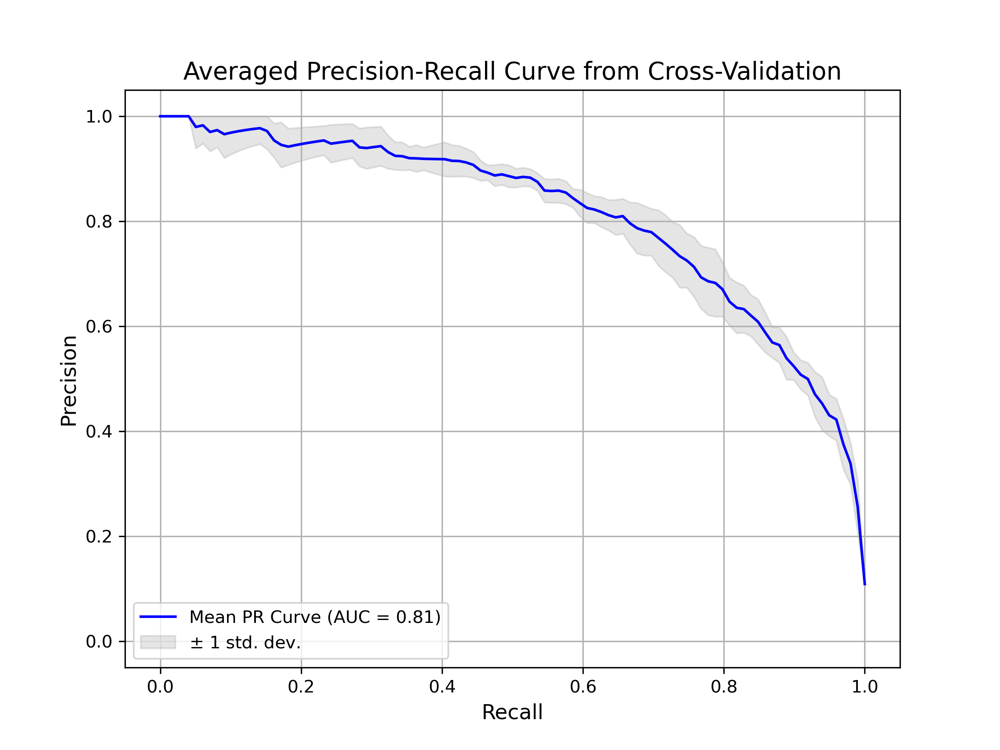
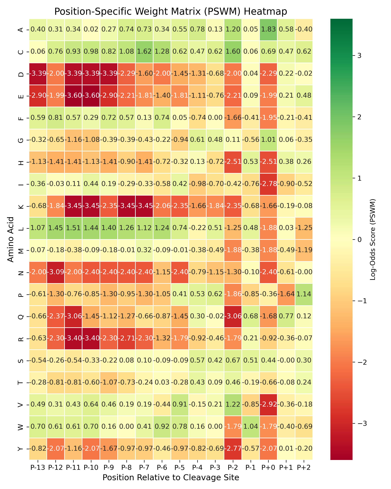

# Model Performance

## Cross Validation
The performance of the model was evaluated using 5-fold cross-validation. The table below shows the mean and standard error for several key performance metrics.

| Metric                    | Value           |
|---------------------------|-----------------|
| F1 Score (Mean ± SE)      | 0.7240 ± 0.0159 |
| Precision (Mean ± SE)     | 0.7503 ± 0.0140 |
| Recall (Mean ± SE)        | 0.7061 ± 0.0345 |
| Avg Threshold (Mean ± SE) | 6.7312 ± 0.1567 |
| MCC (Mean ± SE)           | 0.6942 ± 0.0158 |

## Final Performance on the Test Set
This table shows the overrall acc and the MCC obtained on the testing step on the hold-out set using the highest f1 scoring fold.

| Metric                    | Value           |
|---------------------------|-----------------|
| Overall Accuracy          | 0.9383 |
| MCC                       | 0.6786 |

## Visualizations

### Averaged Precision-Recall Curve

This curve illustrates the trade-off between precision and recall for different thresholds. The area under the curve (AUC) provides a single measure of model performance across all thresholds.

---
### Position-Specific Weight Matrix (PSWM) Heatmap

The PSWM is used to score potential cleavage sites in a protein sequence. This heatmap visualizes the PSWM, where:
*   **Green cells** indicate a higher probability of finding a specific amino acid at that position in a true cleavage site.
*   **Red cells** indicate a lower probability.

This visualization helps to understand the amino acid preferences around the cleavage site.

